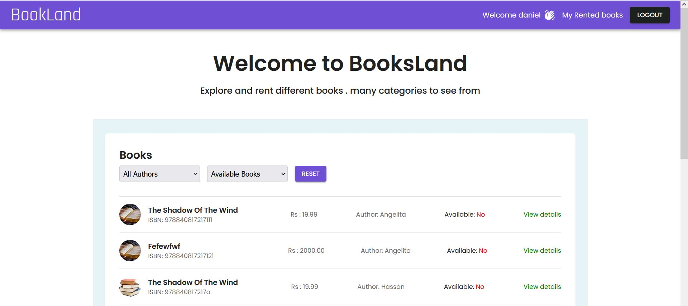
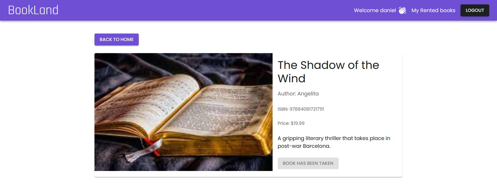
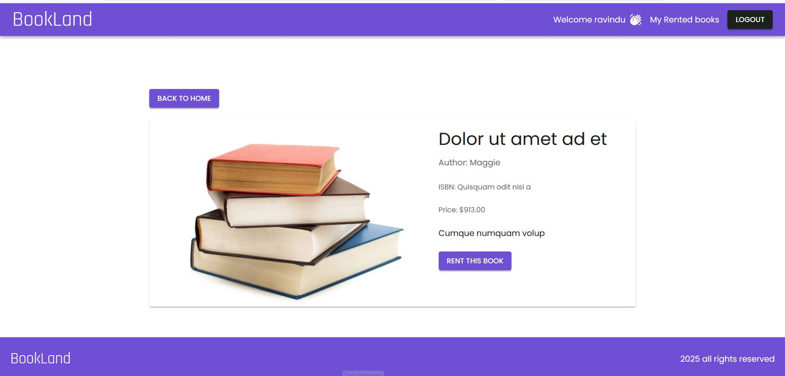
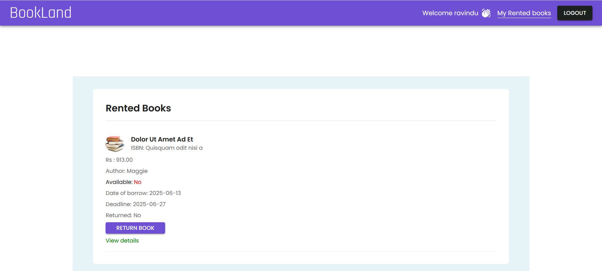

# Book Land (Book Rental Platform)

A full-stack book rental system built using **React + Redux Toolkit (Frontend)**, **Laravel (Backend)**, and **Material UI**. Designed to manage books, rentals, and availability for a small library.

## Main Features

- View paginated list of books
- View Customer rented list of books
- Filter by author or availability
- Add new books via form (Admin only)
- Rent and return books
- JWT authentication 
- Role based access(Customer Admin)

## Tools and Technologies

- Laravel backend with Repository & Service pattern
- React 
- Redux Toolkit
- Material UI 

## Setup Instructions

### Prerequisites

Make sure you have the following installed:

- [PHP](https://www.php.net/) >= 8.2
- [Composer](https://getcomposer.org/)
- [Node.js](https://nodejs.org/) & [npm](https://www.npmjs.com/)
- [MySQL](https://www.mysql.com/) or compatible database; other options include [XAMPP](https://www.apachefriends.org/)

### First Steps

Open a terminal and clone this repo:

```bash
# Clone this repository
git clone 

# Go into the repository
cd book-land

# Remove current origin repository
git remote remove origin

# If you want, you can add a new remote repository
git remote add origin https://github.com/<your-github-username>/<your-repo-name>.git
```

### Backend Setup

1. Navigate to backend folder:

   ```bash
   cd backend
   ```

2. Copy environment config:

   ```bash
   cp .env.example .env
   ```

3. Update `.env` with your database credentials:

   ```env
   DB_CONNECTION=mysql
   DB_HOST=127.0.0.1
   DB_PORT=3306
   DB_DATABASE=book_rental
   DB_USERNAME=root
   DB_PASSWORD=your_password
   ```

4. Install dependencies:

   ```bash
   composer install
   ```

5. Generate app key and JWT secret key and create a symbolic link. Run the following commands one after another:

   ```bash
   php artisan key:generate
   php artisan jwt:secret
   php artisan storage:link
   ```

6. Run migrations and seeders to generate mock data to get the application ready:

   ```bash
   php artisan migrate --seed
   ```

7. Create an admin user: (custom console command is configured for that)

   ```bash
   php artisan make:admin --email=admin@example.com --name=Admin
   ```

   Replace `admin@example.com` and `Admin` with your desired email and name.

8. Start Laravel development server:

   ```bash
   php artisan serve --host localhost --port 8000
   ```

   The API will be available at `http://localhost:8000`.

### Frontend Setup

1. Navigate to frontend folder:

   ```bash
   cd frontend
   ```

2. Copy environment config:

   ```bash
   cp .env.example .env
   ```

3. Update `.env` with the backend API URL:

   ```env
   VITE_API_BASE_URL=http://localhost:8000/api
   ```

4. Install dependencies:

   ```bash
   npm install
   ```

5. Start the development server:

   ```bash
   npm run dev
   ```

   The frontend will be available at `http://localhost:5173`.

6. In the `axios.js` file in the service folder, use the Vite base URL or your custom base URL:

   ```bash
   npm run dev
   ```

   The frontend will be available at `http://localhost:5173`.

## Main API Endpoints

| Method | Endpoint                     | Description                              |
|--------|------------------------------|------------------------------------------|
| GET    | `/api/books`                 | List books (paginated, filterable)       |
| GET    | `/api/books/{id}`            | Get book details                         |
| POST   | `/api/books`                 | Create a new book                        |
| POST   | `/api/books/{id}/rent`       | Rent a book                              |
| POST   | `/api/books/{id}/return`     | Return a book                            |

##  Screenshots










